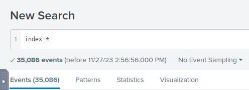
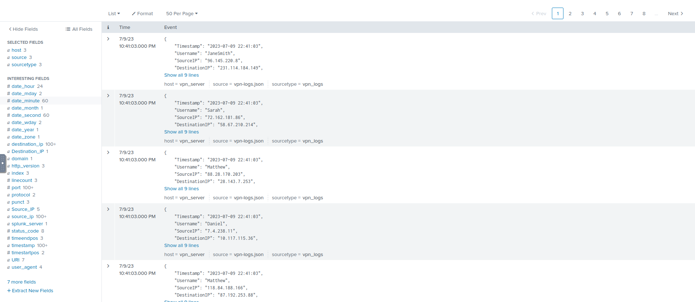
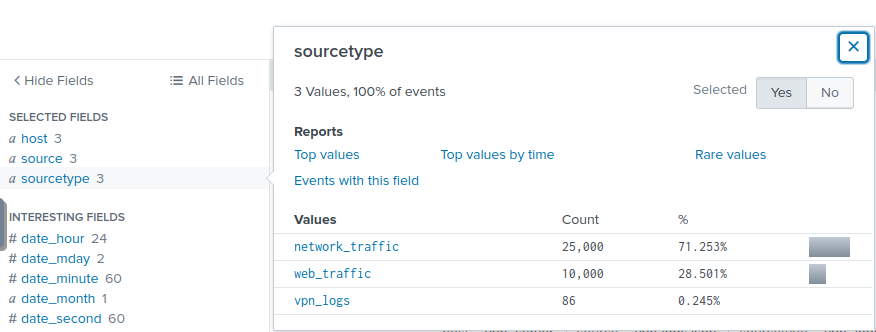

# SIEM-järjestelmän käyttäminen

## Mikä SIEM-järjestelmä on?
SIEM on työkalu, jota hyödynnetään yleisesti tietoturvavalvomoissa. Sen avulla voidaan kerätä dataa useista eri lähteistä kuten tunkeutumisenestojärjestelmistä (IDS), palomuureista ja Windowsin tapahtumalokeista. SIEMin avulla voidaan havaita kerättyjen lokitietojen tietoturvapoikkeamat, joilloin näihin voidaan reagoida asianmukaisella tavalla.

Käsitellään tässä dokumentissa SIEM-järjestelmän toimintoja esimerkkinä käytetään Splunk Enterprise alustaa.

## Aloitusnäkymä
Splunk enterprise aloitusnäkymä on tämän kaltainen. Vasemmassa kulmassa oleva "Search & Reporting" -osio on se johon tässä ohjeessa pääasiassa keskitytään. 

## Search & Reporting
Search & Reporing kautta aukeavasta näkymästä suoritetaan kaikki kyselyt, jotka syötetään kuvassa olevaan "Search" -kenttään. Mutta itse kyselyiden muodostamisesta lisää myöhemmin tässä ohjeessa. Vihreän suurennuslasin vasemmalla olevasta painikkeesta voimme säätää miltä aikaväliltä haluamme hakea tapahtumia. Hakupalkin alla olevasta "No Event Sampling" -painikkeesta voimme hakea satunnaisotannalla esimerkiksi joka tuhannen hakutuloksen. Tämä on hyödyllinen ominaisuus mikäli hakutuloksia on todella paljon samankaltaisia.

### Kyselyn muodostaminen
Tarkastellaan seuraavaksi miten 'Search & Reporting' -ikkunassa voimme suorittaa erilaisia kyselyitä. 

Kyselyiden alkuun tulee index="x", jossa 'x' on datan säilytyspaikka. Suoritetaan haku index=*, niin nähdään millaista eventtejä on saatavilla. 

Haun tuloksena saadaan 35 086 kappaletta erilaista tapahtumaa. Tarkastellaan seuraavaksi tarkemmin, millaisista tapahtumista on kyse.

Mennään 'Selected Fields' kohtaan ja asetetaan kursori kentän 'sourcetype' kohdalle, jolloin nähdään minkälaista dataa meillä on käsiteltävänä. Kuten kuvankaappauksesta nähdään tapahtumat koostuvat VPN-lokista (vpn_logs), verkkoliikenteestä (network_traffic) ja johonkin verkkosivuun kohdistuvasta liikenteestä (web_traffic). 

Voimme valita minkä tahansa kolmesta edellä mainitusta arvosta mikäli haluamme tarkastella esimerkiksi yksinomaan VPN-lokia. Yleisesti ottaen hakutuloksia voidaan rajata eri kentissä olevilla arvoilla. Voidaan siis hakea vain tiettyyn IP-osoitteeseen liittyvä lokitieto, tiettyyn porttiin kohdistettu verkkoliikenne, tiettyyn aikaan tapahtunut tapahtuma ja paljon muuta. 
