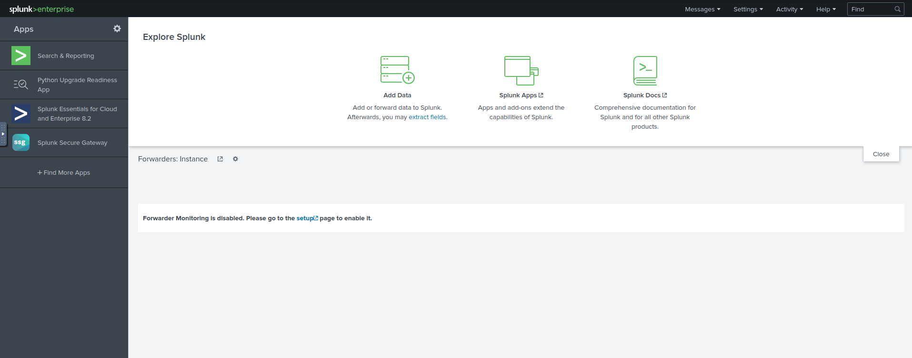
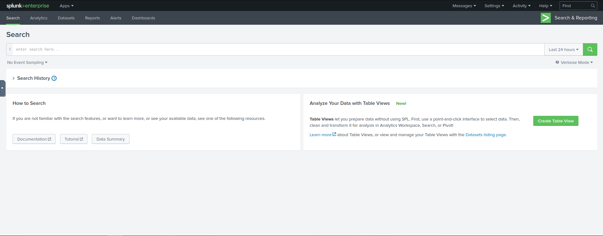

# SIEM-järjestelmän käyttäminen

## Mikä SIEM-järjestelmä on?
SIEM on työkalu, jota hyödynnetään yleisesti tietoturvavalvomoissa. Sen avulla voidaan kerätä dataa useista eri lähteistä kuten tunkeutumisenestojärjestelmistä (IDS), palomuureista ja Windowsin tapahtumalokeista. SIEMin avulla voidaan havaita kerättyjen lokitietojen tietoturvapoikkeamat, joilloin näihin voidaan reagoida asianmukaisella tavalla.

Käsitellään tässä dokumentissa SIEM-järjestelmän toimintoja esimerkkinä käytetään Splunk Enterprise alustaa.

## Aloitusnäkymä
Splunk enterprise aloitusnäkymä on tämän kaltainen. Vasemmassa kulmassa oleva "Search & Reporting" -osio on se johon tässä ohjeessa pääasiassa keskitytään. 

## Search & Reporting
Search & Reporing kautta aukeavasta näkymästä suoritetaan kaikki kyselyt, jotka syötetään kuvassa olevaan "Search" -kenttään. Mutta itse kyselyiden muodostamisesta lisää myöhemmin tässä ohjeessa. Vihreän suurennuslasin vasemmalla olevasta painikkeesta voimme säätää miltä aikaväliltä haluamme hakea tapahtumia. Hakupalkin alla olevasta "No Event Sampling" -painikkeesta voimme hakea satunnaisotannalla esimerkiksi joka tuhannen hakutuloksen. Tämä on hyödyllinen ominaisuus mikäli hakutuloksia on todella paljon samankaltaisia.

